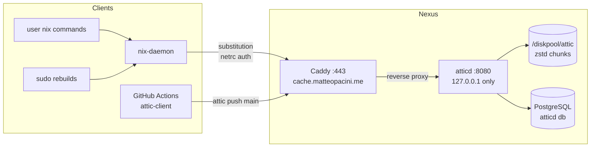
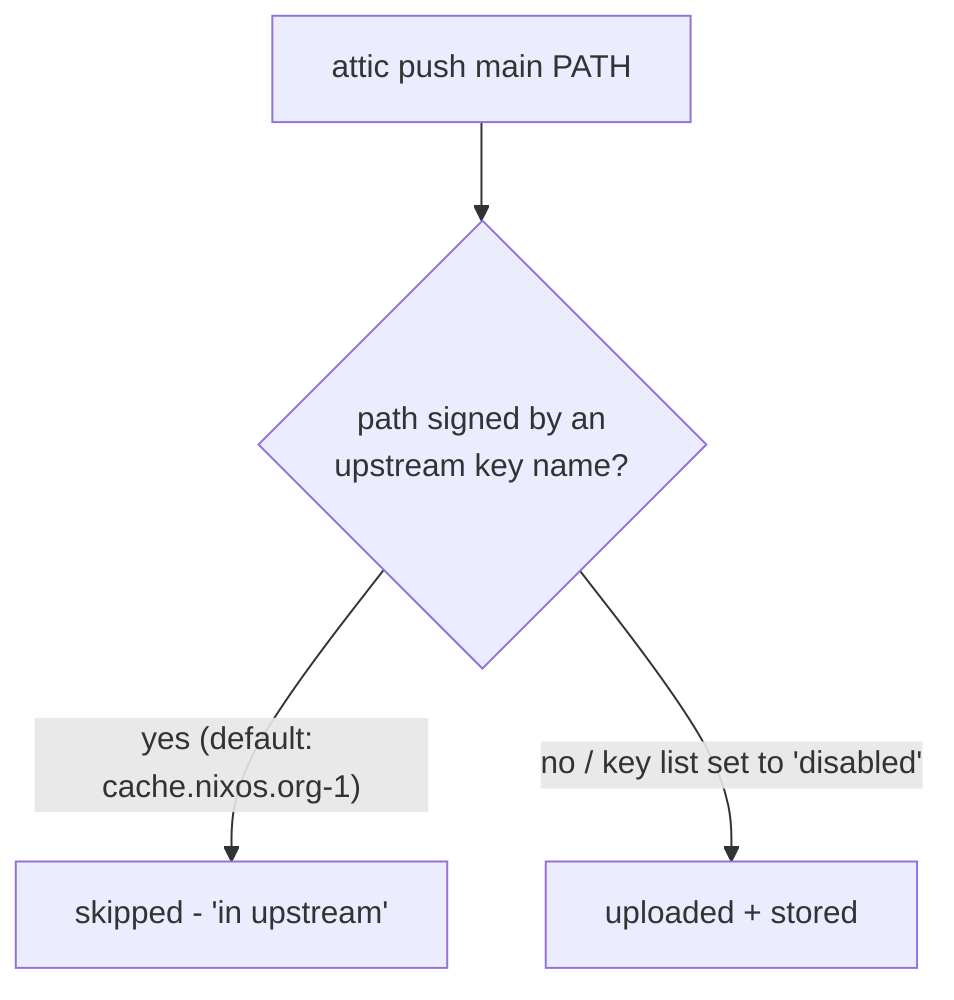

# Nexus Attic Cache Handbook

Self-hosted Nix binary cache (attic), replacing the former Fly.io +
Cloudflare R2 deployment. Migrated 2026-06-09/10 (PRs #282–#287).

## Quick Reference

| Item | Value |
|------|-------|
| Public URL | `https://cache.matteopacini.me` |
| Cache name | `main` (single cache, all hosts + CI) |
| Cache visibility | private (token required for pull and push) |
| Signing key | `main:qAfi80bao6jxVrLVIuX07sthJscb2CcFBboYsEBxdG4=` |
| NAR/chunk storage | `/diskpool/attic` (owner `atticd:atticd`) |
| Metadata DB | PostgreSQL, database `atticd`, socket peer auth |
| atticd listen | `127.0.0.1:8080` (Caddy-only) |
| Server config | `hosts/Nexus/services/attic.nix` |
| Client wiring | `custom.nix-core.atticCache` (NixOS + Darwin modules) |
| Server JWT secret | agenix `nexus/attic-env` |
| Client tokens (netrc) | agenix `<host>/attic-netrc`, one per adopter host |
| Admin CLI (server) | `atticd-atticadm` (on Nexus) |
| Push helper (clients) | `attic-push-closure <store-path>...` |

## Architecture Overview



Key properties:

- **One cache (`main`) for everything.** Attic deduplicates chunks
  globally across caches on the same server, so per-host caches saved
  no space — and every extra substituter costs one lookup per cache
  miss on every build.
- **Private cache.** Both pulls and pushes require a token. Public DNS
  resolves the domain to the WAN IP; the router's split DNS hands LAN
  clients the LAN IP; Nexus itself pins the domain to loopback (see
  [Gotchas](#gotchas)).
- **Chunking is tuned for fewer, larger files** on the mergerfs pool
  (1 MB NAR threshold, 64 KB–1 MB chunks) rather than maximum dedup.

## How Clients Are Wired

Adopter hosts enable the shared module option:

```nix
custom.nix-core.atticCache = {
  enable = true;
  netrcFile = config.age.secrets."<host>/attic-netrc".path;
};
```

This lands three settings in the **system** `nix.conf`
(`modules/nixos/nix-core.nix` / `modules/darwin/nix-core.nix`):

- `extra-substituters = https://cache.matteopacini.me/main`
- `extra-trusted-public-keys = main:...`
- `netrc-file = /run/agenix/<host>/attic-netrc`

### Why system-level and not flake `nixConfig`

Flake `nixConfig` only applies to trusted users, prompts each user
interactively once, and is useless on hosts without a token (401 noise).
System `nix.conf` applies to every user — including root during
`sudo nixos-rebuild` / `darwin-rebuild` — with no prompts.

### Who reads what (the 401 asymmetry)

| Flow | Who downloads | Reads the netrc? |
|------|---------------|------------------|
| `nix build`, `nix-store --realise` (any user) | nix-daemon (root) | yes |
| `sudo nixos-rebuild` / `darwin-rebuild` | nix-daemon (root) | yes |
| `nix store info --store https://…` (no sudo) | the user's own process | **no → 401** |

All real workflows go through the daemon, which runs as root and can
read the root-owned netrc. A plain user querying the cache directly
with `--store` gets a 401 **by design** — that is not a fault.

### Adding a new host

1. Get the host's SSH host key: `cat /etc/ssh/ssh_host_ed25519_key.pub`
2. Add it to `secrets/secrets.nix` and declare
   `"<host>/attic-netrc.age"` for it.
3. Create the secret (netrc format, see below) encrypted to that key,
   under `secrets/<host>/attic-netrc.age`.
4. Wire `age.secrets."<host>/attic-netrc"` in the host's `flake.nix`
   block (Darwin hosts also need `inputs.agenix.darwinModules.default`
   and `age.identityPaths = [ "/etc/ssh/ssh_host_ed25519_key" ];`).
5. Enable `custom.nix-core.atticCache` as above; rebuild.

## Authentication & Tokens

- The **server** signs and verifies client tokens (RS256 JWTs) with a
  keypair from the agenix secret `nexus/attic-env`
  (`ATTIC_SERVER_TOKEN_RS256_SECRET_BASE64`).
- **Clients** authenticate with a token embedded in a netrc file:

  ```
  machine cache.matteopacini.me
  password <token>
  ```

  Nix sends it as HTTP basic auth; attic reads the password field as
  the bearer token.

### Generating tokens

On Nexus:

```bash
# interactive / personal (broad)
sudo atticd-atticadm make-token --sub matteo --validity 2y \
  --pull '*' --push '*' --create-cache '*'

# CI (scoped: cannot create or reconfigure caches)
sudo atticd-atticadm make-token --sub github-actions --validity 1y \
  --pull main --push main
```

### Rotating the token

1. Generate a replacement token (above).
2. Re-encrypt every `secrets/<host>/attic-netrc.age` with the new
   token (netrc format above; encrypt with `age -r "<host pubkey>"`).
3. Update the `ATTIC_TOKEN` GitHub Actions secret.
4. Rebuild the adopter hosts.
5. Scrub the old token from shell history if it was ever pasted into a
   terminal (see [Cleaning Up Legacy Client State](#cleaning-up-legacy-client-state)).

The server JWT secret (`nexus/attic-env`) normally never rotates —
rotating *it* invalidates **all** tokens at once.

### Manual token integration (unmanaged user/machine)

For a machine (or user) not managed by this flake — e.g. a work
machine where only your user account is yours:

```bash
# 1. netrc with the token, private to you
install -m 600 /dev/null ~/.config/nix/netrc
cat > ~/.config/nix/netrc <<'EOF'
machine cache.matteopacini.me
password <token>
EOF

# 2. user-level nix config — use extra-* keys ONLY
mkdir -p ~/.config/nix
cat >> ~/.config/nix/nix.conf <<'EOF'
extra-substituters = https://cache.matteopacini.me/main
extra-trusted-public-keys = main:qAfi80bao6jxVrLVIuX07sthJscb2CcFBboYsEBxdG4=
netrc-file = /home/YOU/.config/nix/netrc
EOF
```

Rules that make this safe where `attic use` is not:

- **Always `extra-substituters` / `extra-trusted-public-keys`** — the
  un-prefixed keys *replace* the system lists instead of appending,
  which silently disconnects you from every other cache.
- `netrc-file` must be an absolute path (no `~` expansion in nix.conf).
- If your user is not trusted by the daemon, `extra-substituters` is
  honored only if the admin lists the cache in `trusted-substituters`.
- Never run `attic use` — it writes un-prefixed overrides (see
  [Gotchas](#gotchas)).

## Pushing to the Cache

### `attic-push-closure` (adopter hosts)

```bash
sudo attic-push-closure /run/current-system     # the usual case
sudo attic-push-closure ./result                # a build output
```

Defined once in `modules/shared/attic-push-closure.nix`. It is
root-only (the token lives in the root-readable netrc), logs in inside
a throwaway `XDG_CONFIG_HOME`, pushes, and removes it on exit — no
attic client state is left behind.

### Ad-hoc (any machine, nothing installed)

```bash
nix run nixpkgs#attic-client -- login nexus https://cache.matteopacini.me '<token>'
nix run nixpkgs#attic-client -- push main /run/current-system
rm -rf ~/.config/attic        # login writes client config; clean up
```

### CI

All three workflows (`build.yml`, `pr-build.yml`, `build-package.yml`)
log in with the `ATTIC_TOKEN` repository secret and push build results
to `main`. The login alias is hardcoded; there is no
`ATTIC_CACHE_NAME` secret.

`pr-build.yml` pushes the PR's candidate toplevel (`result`) so the
post-merge master build in `build.yml` is a cache hit rather than a
full rebuild. Because attic dedups chunks globally, this adds only the
PR's delta over what `build.yml` already pushed — not a second copy of
the closure. Merged paths get re-pinned by `build.yml`; abandoned-PR
paths carry no special retention and simply age out under the
server-wide GC window. This is why a separate short-retention "PR
cache" was not created: global dedup already makes the second push
disk-cheap, and a second cache would only add a substituter lookup per
build plus its own token and upkeep.

## Cache Administration (on Nexus)

### One-shot authenticated admin session

`attic cache configure` needs permissions the day-to-day token may not
have. Mint a short-lived admin token and keep the client config in a
throwaway directory:

```bash
export XDG_CONFIG_HOME=$(mktemp -d)
TOKEN=$(sudo atticd-atticadm make-token --sub admin --validity 1h \
  --pull main --configure-cache main --configure-cache-retention main)
nix run nixpkgs#attic-client -- login nexus https://cache.matteopacini.me "$TOKEN"

# ... admin commands here ...

rm -rf "$XDG_CONFIG_HOME"; unset XDG_CONFIG_HOME
```

### Retention period

```bash
nix run nixpkgs#attic-client -- cache configure main --retention-period "1 year"
nix run nixpkgs#attic-client -- cache info main      # verify
```

Per-cache retention (stored in the DB) overrides the server-wide
`default-retention-period` in `hosts/Nexus/services/attic.nix`, which
keeps applying to any future caches. Prefer editing `attic.nix` while
`main` is the only cache — it lives in git.

### Mirroring upstream (cache.nixos.org) paths

By default attic skips paths signed by `cache.nixos.org-1` on push
(shown as `N in upstream`). cache.nixos.org is **not** append-only
anymore — its first real GC ran 2026-02-19 (~100 TiB of image
artifacts) and broader NAR GC is openly planned — so mirroring what
you depend on is a legitimate hedge.

```bash
# replace the upstream key list with a nonexistent key name
nix run nixpkgs#attic-client -- cache configure main --upstream-cache-key-name disabled
```

After this, pushes include nixpkgs-built paths; pair it with a long
retention period or the mirror gets GC'd anyway. Trade-offs: the first
full-closure push uploads everything upstream used to absorb, and CI
pushes grow accordingly. Pull preference is unaffected
(cache.nixos.org priority 40 beats this cache's 41; ours is the
fallback).



### Checking cache size

```bash
du -sh /diskpool/attic        # actual disk usage (compressed, deduped)

sudo -u postgres psql atticd -c \
  "SELECT count(*) AS chunks,
          pg_size_pretty(sum(file_size)::bigint)  AS on_disk,
          pg_size_pretty(sum(chunk_size)::bigint) AS uncompressed
   FROM chunk;"
```

### Regenerating the signing keypair

```bash
nix run nixpkgs#attic-client -- cache configure main --regenerate-keypair
```

Blast radius: every previously-pushed path becomes untrusted, and the
new public key must be rolled out to `extra-trusted-public-keys` in
`modules/{nixos,darwin}/nix-core.nix` and to this handbook. Avoid
unless the key is compromised.

## Cleaning Up Legacy Client State

In the Fly.io era, `attic use` wrote **per-user** overrides that
shadow the flake-managed system config and keep biting long after:

- `~/.config/nix/nix.conf` with un-prefixed `substituters`,
  `trusted-public-keys`, `netrc-file` → the cache is silently ignored
  (or 401s) for that user; for **root's** home, for every
  `sudo nixos-rebuild` too.
- `~/.config/attic/config.toml` with the dead fly.dev endpoint as
  `default-server` → `attic` commands hang or hit DNS errors.

Symptoms: 401s from the cache, builds not substituting from it,
`attic` commands contacting `zpnixcache.fly.dev`.

Fix — run once per host (covers the invoking user **and** root):

```bash
./scripts/wipe-user-nix-config.sh
# or remotely:
ssh -t <host> 'sh -s' < scripts/wipe-user-nix-config.sh
```

Verify afterwards: `nix config show | grep -E '^substituters|^netrc'`
must show only system values.

### Scrubbing pasted tokens from shell history

If a token was ever pasted into a command line:

```bash
# atuin (syncs deletions to the self-hosted server as tombstones)
atuin search --cmd-only "<token fragment>"
atuin search --delete "<token fragment>"
atuin sync

# plain zsh history (atuin does not manage it)
grep -v "<token fragment>" ~/.zsh_history > ~/.zsh_history.tmp \
  && mv ~/.zsh_history.tmp ~/.zsh_history
```

Other synced machines pick up the atuin tombstones on their next sync.

## Gotchas

- **Hairpin NAT**: Nexus resolves the cache domain via public DNS to
  the WAN IP, which the router won't loop back — connections hang.
  Fixed by `networking.hosts."127.0.0.1"` in `attic.nix`. LAN clients
  are covered by the router's split DNS instead; if a new vhost
  misbehaves only from inside the LAN, suspect this first.
- **fail2ban**: the cache vhost is exempted from the `caddy-botsearch`
  jail (`fail2ban.nix`) — narinfo 404s are normal cache misses, and the
  jail would ban a legitimate client after two of them. The
  `caddy-http-auth` jail still applies: a client hammering with an
  expired token gets banned (`sudo fail2ban-client unban <ip>`).
- **Caddy body cap**: 8 GB per request on the cache vhost — generous
  for the largest NARs while bounding what an attacker can stream.
- **`attic use` considered harmful**: it recreates the per-user
  overrides described above. Use `attic login` (token only) and let the
  system config handle substitution.
- **Backups**: the `atticd` PostgreSQL database is included in
  `pg_dumpall` (metadata only, small). `/diskpool/attic` chunk data is
  deliberately **not** backed up to B2 — cache contents are
  re-creatable, and backing them up would reinstate the storage costs
  this migration removed. SnapRAID parity still covers the disks.

## Changelog

| Date | Change |
|------|--------|
| 2026-06-09 | Migrated from Fly.io + R2 to self-hosted atticd on Nexus; Fly apps destroyed, R2 bucket emptied (#282) |
| 2026-06-09 | Single `main` cache; signing key trusted; hairpin loopback pin; netrc on Nexus + WorkLaptop; CI rewired (#283) |
| 2026-06-10 | Cache config moved to system nix level via `custom.nix-core.atticCache`; flake `nixConfig` dropped (#284) |
| 2026-06-10 | `attic-client` removed from systemPackages; push script + `wipe-user-nix-config.sh` added (#285) |
| 2026-06-10 | BrightFalls adopted the cache (#286) |
| 2026-06-10 | Push script generalized to `attic-push-closure`, defined once in `modules/shared/` (#287) |
